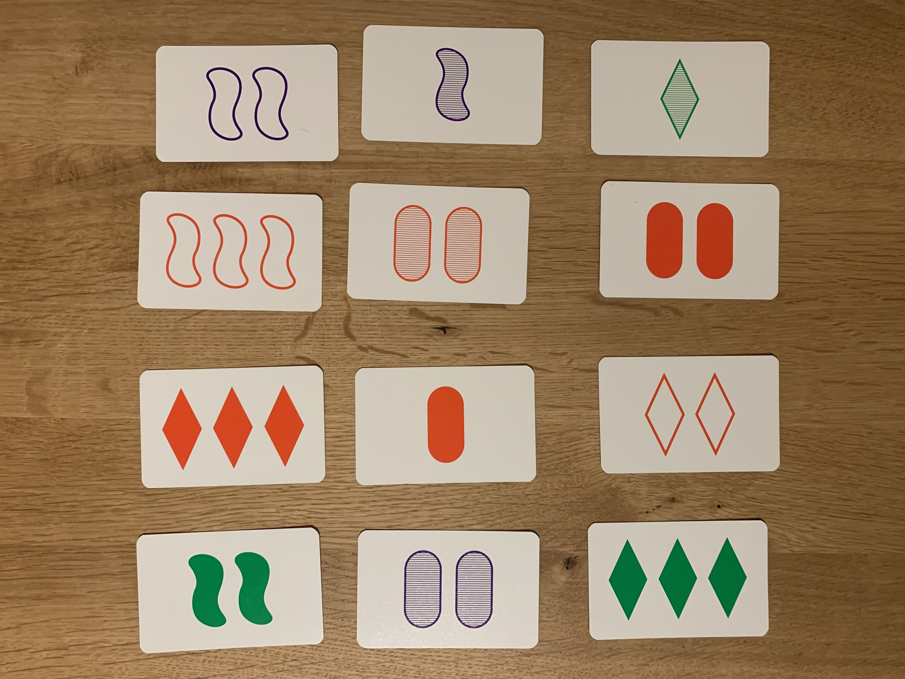

# setsolver-api
The API for the the SET solver. 
Idea: 
- Receives an image of set cards and detects valid sets.
- API implemented with Flask and model trained with pytorch (see https://github.com/alu82/setsolver-card-classifier)

Currently the card extraction from an image and afterwards the classification works best, when
- the cards do not overlap
- the cards are arranged parallel to the picture border (in a grid, how many cards are in each column, row doesn't matter)
- the table is not white, so there is a contrast between a card and the background
- there are no shadows on the cards (they are recognized as contour). Try using the flashlight of your camera in case you get strange results

Example image


## how to run
I recommend to run the API in a docker container, although it is obviously possible to run it directly on the local machine. The build process of the docker image is a bit long (~10minutes), the first time it is build (download of pytorch), but afterwards this layer remains keeps unmodified. So the buildprocess of the image is a matter of seconds. 

### docker (recommended)
#### build
```
docker build -t setsolver-api:latest .
```

#### run
```
docker run -d -p 5000:5000 setsolver-api
```

### install locally (alternative)

#### install packages
Installs base packages and the setsolver api module. You should create a separate virtual environment for the api.
```
pip install --no-cache-dir -r requirements.txt -f https://download.pytorch.org/whl/torch_stable.html
pip install .
```

#### run
Runs the API in a terminal, and makes it accessible via localhost
```
export FLASK_APP=setsolverapi
flask run --host=0.0.0.0
```

## how to use
The API has one endpoint `solve` that where an image of a set board can be posted to. This can be done in different ways:

### cURL
```
curl -k -X POST -F 'file=@/path/to/file.jpeg' http://localhost:5000/solve
```
For testing the API you can use the example image above.

### setsolver app
I created a web app that can be used together with the api backend. The web app can take a picture of a set board, when opened on a mobile device, post it to the solve endpoint and then display the response. For more details see https://github.com/alu82/setsolver-web

## the response
The API returns a json sstructure with 2 properties:
- extractedCards: which cards have been extracted and detected by the model (incl. the probability). For a matching of card id to the card properties see https://github.com/alu82/setsolver-card-classifier/tree/main/images/test
- foundSets: an array with triples of card ids which form a valid set.